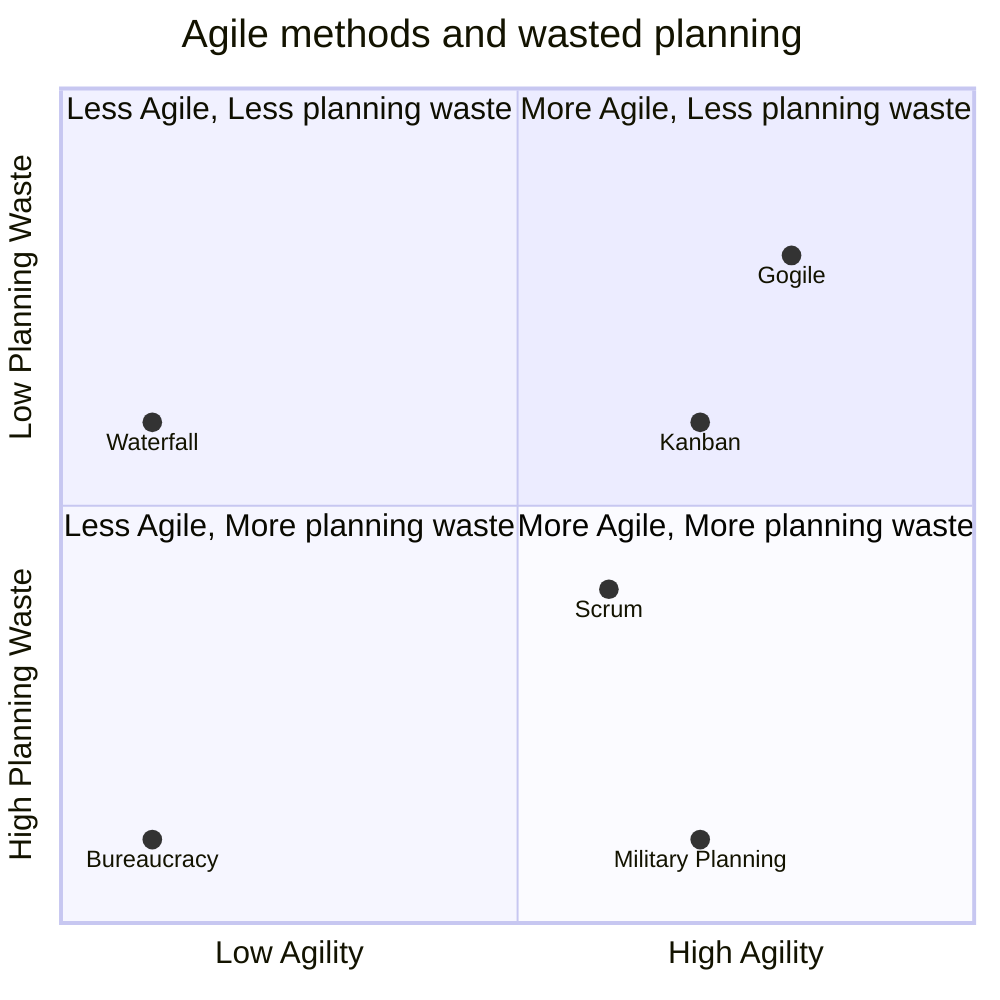

# Gogile overview
Go(lf a)gile is an agile software development process.
It aims at reducing planning waste and increasing development velocity.

# Table of contents

- [Gogile overview](#gogile-overview)
- [Table of contents](#table-of-contents)
  - [The Golf Analogy](#the-golf-analogy)
    - [Scrum](#scrum)
      - [Before starting](#before-starting)
      - [After each task](#after-each-task)
    - [The Gogile Approach](#the-gogile-approach)
      - [Before starting](#before-starting-1)
      - [After each task](#after-each-task-1)
    - [What Gogile does differently](#what-gogile-does-differently)
      - [Task Estimations](#task-estimations)
      - [Project Estimations](#project-estimations)
      - [Bugs](#bugs)
      - [Testing](#testing)
  - [Compared with other methods](#compared-with-other-methods)
    - [Waterfall](#waterfall)
    - [Scrum](#scrum-1)
    - [Kanban](#kanban)
    - [Military planning](#military-planning)
    - [Bureaucracy](#bureaucracy)
    - [Gogile](#gogile)

## The Golf Analogy
Even if you've never played golf, the analogy is useful to explain the mindset of Gogile.

When you play golf you play a course consisting of a number of holes (usually 18). Each hole has a starting point (the tee) and a hole. The player's goal is to get from the tee to the hole in as few strokes as possible, for each hole.
Some holes are short, some are long.

Simplifying things somewhat the player uses a series of different stroke types, to complete the hole:
- A drive is a long distance stroke.
- A pitch is a medium distance stroke.
- A chip is a short distance stroke.
- A putt is a very short distance stroke.

The longer the stroke, the lower the accuracy.

If you translate this to software engineering, the course can represent a release, internal or external, or similar milestone. The holes are features, or goals, needed to get to that release. The strokes are tasks, of different sizes, that can be merged to the branch that the team use to create the release.

### Scrum
Using Scrum, this analogy could play out like this.

#### Before starting
Before the sprint start you gather at the tee. PO, DM, Devs, testers. The PO explains what the goal, "the hole", is.

Now, the group attempts to plan a large series of small tasks that will get project to that goal. The tasks are kept small to give flexibility and estimation accuracy. When the sprint starts, the developer tees off, using the putter for the first small task. 

#### After each task
When the task is done the testers take a look and checks if the stroke was exactly according to plan, if not small adjustments are made until everyone agrees that this is where the first stroke should have ended. 

The developer now lines up for another putt and the process repeats. 

After 10 putts the PO realizes that this is not really heading in the right direction.

Everyone backtracks 5 strokes and tries to get back on track. The tasks originally planned stay in the backlog, to be completed when the group arrives there. (Spoiler: they will never get there and the tasks will exist in the backlog for the rest of the project).

After 25 putts the goal is in the hole and the group starts planning the tasks for the next hole, that needs to be started ASAP.

### The Gogile Approach

#### Before starting
The PO, DM, Dev and testers meet at the tee and discuss the goal for this first hole. 

It should be achievable in approximately 2 weeks. Once the goal is agreed the Dev is asked what they would spend 3-5 days on to get as close to that goal as possible. This is a "drive". At the end of that task the work should be mergeable and stable. A task documenting this work is created. The drive doesn't have to be accurate, as long as long as it gets the team closer to the goal. In the meantime the testers are sent to the hole to work on how to test everything once the ball is in the hole.

#### After each task
The Dev get to work and after completing the task there is no testing. Instead the PO and Dev meet to define the next stroke/task. Depending on the outcome of the drive they might plan a pitch, chip or putt (M/S/XS task). It's possible that the drive went out of bounds and need to be back tracked and a new drive made with the new knowledge gained from the first one.

This is repeated until the ball is in the hole. At that point the testers have tests defined to see how well the full product fulfills the requirements after this hole.

There is no backlog. All tasks are planned with the completion of the previous one. This ensures all tasks are created with the maximum amount of knowledge and always started after being created.

### What Gogile does differently

#### Task Estimations
Estimations are flipped from "How long will this take?" to "What would you do with this amount of time?. Estimations are also always done together with the implementor, reducing the inaccuracy caused by "It would take ME this long, but I don't know how long Jane Doe would need" discussions.

Devs should focus on planning and performing the "strokes". They need to understand the goals for the hole and the course goals to ensure architecture is aligned with the bigger picture.

It will take a lot more small meetings with focused groups to plan each stroke, but time will be freed up by removing long backlog refinement meetings in large groups, sprint planning meetings etc.

#### Project Estimations
High level estimations, such as "How long will this project take and what resources are needed?", will be performed outside of this process by POs, DMs, PMs, tech leads and SMEs.

#### Bugs
Bugs are left out of the process. Bugs should be tracked separately and tested immediately after fixing.

#### Testing
Testers should focus on testing the product based off requirements and functional designs, instead of testing individual tasks. Continuous testing can generate bugs or the need for new "holes" to be added to the course.

PO should make sure there are clear, well defined, goals/"holes" and attend the stroke planning to make sure it's aimed at the target.

DM should look at the "course" and ensure the correct resources are in place at the right time. Also DM should make sure work that is depending on other teams is aligned and prepared.

## Compared with other methods
So, what are the trade offs of using Gogile?

The chart below describe different methods and their corresponding agility vs. planning waste.

Gogile is aimed at reaching the sweet spot quadrant of "*More Agile, Less planning waste*"

### Waterfall
You plan everything before starting work. Not very agile.

Planning waste is ideally low, but in reality realizations during development create planning waste.

### Scrum
More agile, but only between sprints. Unforeseen discoveries during development is difficult to accomodate during the sprints.

Planning waste comes mostly from trying to plan everything before starting the sprint. Any deviations from the plan will create carry over tasks, sending tasks back to the backlog or having to rewrite tasks.

### Kanban
Higher agility, since you can change the backlog at any time.

Planning waste comes from filling up the backlog with tasks based on the current state. When the current state changes, already created tasks might become stale.

### Military planning
Not a real method. Included only for perspective.

The end goal is clear. Plans to achieve it are created along with large amounts of contingency plans for unexpected outcomes. Fairly agile thanks to the contingency plans.

Huge planning waste, since most contingency plans are newer used.

### Bureaucracy
Not a real method. Included only for perspective.

Every event is analyzed and discussed before any action is taken.

Very low agility caused by endless discussions and passing of decisions to different instances.

Very high planning waste, caused by planning effort being extremely high compared to the actual outcome.

### Gogile

High agility, since all actions are started from the current state with the most up to date knowledge.

Low planning waste, since pre planning is limited. Planning is done when it's ready to be put into action.
